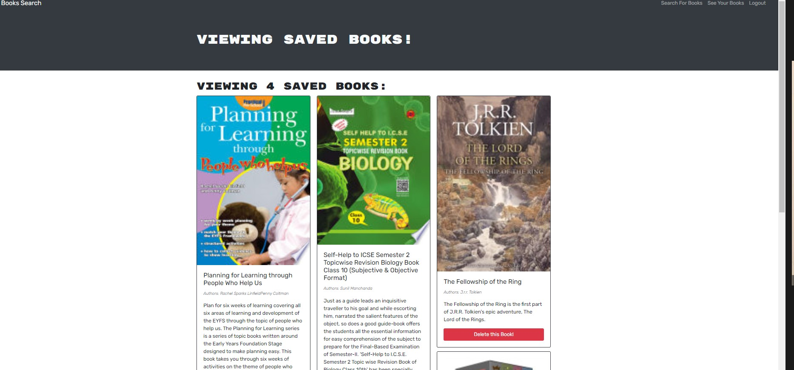

# Book_Search
Allow users to search books. 
Google Books Search
Screenshot of Google Books Search

## Description
Google Books Search is a React app that allows you to search for books using Google Books API and save a list of books to your account. Built with React and GraphQL.

## Built With
React GraphQL Apollo GraphQL Bootstrap JavaScript node.js CSS
## Screenshot

## Usage
To use, follow the provided link, sign up to create an account, and search. When you find a book you want to keep, click to save the book to your book list. If you want to remove a book, find the book in your saved books and click to remove.

## References
https://www.w3schools.com/
https://create-react-app.dev/docs/deployment/#github-pages
https://www.youtube.com

## Repository Link
https://github.com/Samw1s3/book_search

## Application Link

## Acknowledgements
React-Bootstrap
apollo-server-express
Tech badges by Ileriayo
Google Books API
Back to Contents